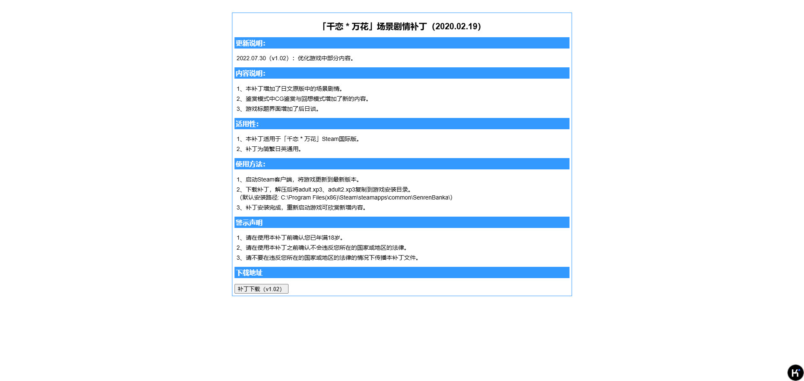

# 千恋万花补丁方法

处于对用户身心健康考虑，官方的（也就是Steam版本的）《千恋万花》并没有提供涩情内容，但是处于对用户提要考虑，还是有一个对应的解锁补丁可以使用，这篇文档的内容就是获取和使用补丁的方法。

# 正文

## 下载补丁

这个[网站](https://steamgalgame.com/Senren_Banka.html)是一个很大的库，包含了很多Galgame的补丁，不过我平时不玩Galgame（千恋万花是个例外），所以对其中的内容不是很了解。

直接打开链接，就是千恋万花的页面，向下滑到"额外内容"部分，即可找到下载链接。

我一般选择官方链接，不过应该无所谓。

下载好之后，将会得到一个7z格式的压缩包。

## 安装补丁

其实在下载补丁压缩包的页面就可以看到使用方法，出于省事儿目的，下面就直接复制粘贴了。

1、启动Steam客户端，将游戏更新到最新版本。

2、下载补丁，解压后将adult.xp3、adult2.xp3复制到游戏安装目录。
（默认安装路径: C:\Program Files(x86)\Steam\steamapps\common\SenrenBanka\）

3、补丁安装完成，重新启动游戏可欣赏新增内容。

END！